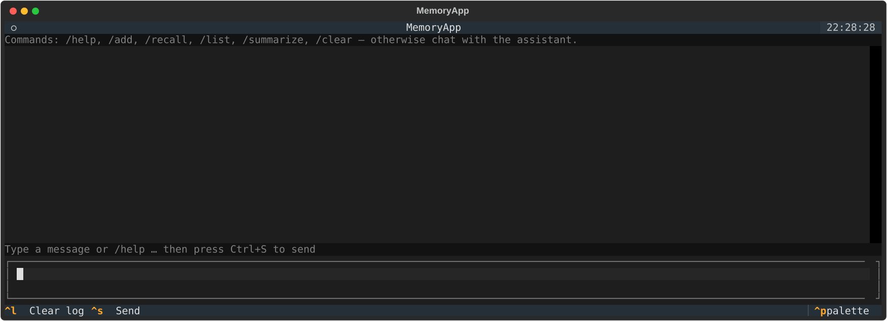

# Minimum personal assistant: Shiye (师爷)

> a baby step a day, or maybe every two, three, four... days...

## Current status

### Dev run



The ongoing project:

```bash
python main.py
```

What it does:

- multi-round chat with DS backend
- Text UI
- add stuff to the context, sorta in context learning
- summarize the context
- enhanced timeline processing
- multiple copy input input box

Storage/embeddings (v0):

- Local SQLite + FAISS live under `~/.shiye` by default (override with `SHIYE_DATA_DIR`).
- Default embedding model: `sentence-transformers/all-MiniLM-L6-v2` (override with `SHIYE_EMBED_MODEL`); download once while online.
- Requires `faiss-cpu` and `sentence-transformers` from `requirements.txt`.

Testing:

- Activate your env (e.g., `source ~/.virtualenvs/dspytest/bin/activate`) and run `python -m pytest -q`.
- Tests use temp data dirs; the real files appear after you run the app or write to the store (default `~/.shiye/shiye.db` and `~/.shiye/shiye.faiss`).

RSS brief (micro-app):

- Configure feeds in `rss_feeds.txt` (one URL per line). Defaults include Google Research, OpenAI, DeepMind, Microsoft Research.
- Run `/rss` in the app to fetch latest items, cap per feed, and generate a concise digest with references. The daily digest is stored as `doc_type=rss_daily_summary` in local storage.

Planning/roadmap: see `TODO.md` for the working plan and open questions.

## End Goal

Functions-wise, what's most important to me, for my personal uses:

- a personal off-brain data bank storing raw original date, and strucutrized ones easier for LLM investigation
  - web, wechat readings
  - acamdeic papers, pdfs
  - books, epub, mobi
  - mails
  - etc.
- a mostly chat based assistant inferace that
  - makes add-hoc tools/mini app from test instructions, tool execution via LLM API or scripts
  - maintains the personal off-brain data banks, knows what are my current focus topics, what out stall archives
  - updates the off-brain data banks with meaningful exchanges with the assistant
  - is sessionless facing the user, yet user may still explicit ask to start afresh or telling the focus topic as of now
  - make good use of the off-brain data banks in interactions, yet may also makes searches or call other tools to help along with the quest
  - may use different LLM backend eventual
  - proactively suggestion actions at fitting moment

## achitectural considerations

TBD, main components, what to build first


## Next bady steps (outdated)

- [x]: refactor the mvp in a more modular layout
- scope on certain in-context logs by semantic, time cues
  - [x] modify the log data structure, ask LLM to break down into time atomic pieces
  - [x] for each piece two time stamps, one for creation, one for event
  - [ ] pick a benchmark and SOTA on tineline reasoning, maybe https://huggingface.co/papers/2505.12891
  - [ ] how to test the in context log scoping ?
- save logs on scoping
- clear logs on scoping
- stash away, save and then clear on scoping
- summarize and then stash, summary in context, logs saved out
- scope external logs by semantic, time cues
- load stashed logs back
- auto stash, summarize, load back
